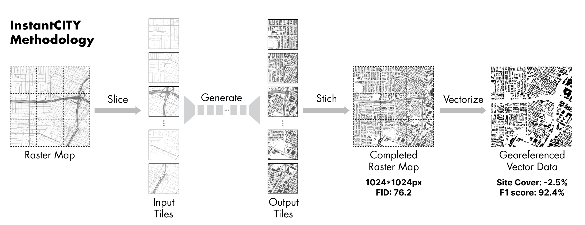

<p align="center">
  <a href="https://ual.sg/">
    
  </a>
  <h3 align="center">InstantCITY: Synthesising morphologically accurate geospatial data for urban form analysis, transfer, and quality control</h3>
  <a >
    
  </a>
</p>

This is the official repo of InstantCITY, a Geospatial Data Translation model for urban form analysis, transfer, and quality control

## Running InstantCITY 
### 1. Install prerequisites

Use `environment.yml` to create a conda environment for GANmapper

  ```sh
  conda env create -f environment.yml
  conda activate IC
  ```

### 2. Download weights
The weights files are available on figshare in the Checkpoints folder.

```https://doi.org/10.6084/m9.figshare.15103128.v1```

Place the `Checkpoints` folder in the repo.
### 3. Prediction
Predictions can be carried out by running the following sample code. The name of the city depends on the name of each dataset.

 ```sh
 python test.py --name <model_name> --dataroot <path to input XYZ tile dir with street networks> 
  ```

Testing an area in New York:
 ```sh
 python test.py --name NY15 --dataroot ./datasets/Test/NY/input/15 
  ```

Testing an area in Singapore:
 ```sh
python test.py --name SG15 --dataroot ./datasets/Test/SG/input/15 
  ```

Testing an area in London:
 ```sh
python test.py --name London15 --dataroot ./datasets/Test/London/input/15 
  ```

The result will be produced in XYZ directories in `./results/<cityname>/test_latest/images/fake`

### 4. Style Transfer
Transfering the style of one city to another, in this case, a model trained in New York City is used to predict the morphology in Detroit.
 ```sh
python test.py --name NY15 --dataroot ./datasets/Transfer/Detroit/input/15
  ```

Or transfering the urban texture of Jakarta to the street network of Manila

 ```sh
python test.py --name Jakarta15 --dataroot ./datasets/Transfer/Manila/input/15
  ```

You can choose to visualise the tiles in QGIS using a local WMTS server.
For example, use the following url and choose Zoom 15 only.
```
file:///D:/InstantCITY//datasets/Test/SG//fake//{z}//{x}//{y}.png
```

### 4. Metics and Vectorization

Please see the jupyter notebook in `datasets/Metric.ipynb` for FID score computation and vectorization.

## License

Distributed under the MIT License. See `LICENSE` for more information.

<!-- ## Citation

If you like this work and would like to use it in a scientific context, please cite this article.
```
@misc{wu2021ganmapper,
      title={GANmapper: geographical content filling}, 
      author={Abraham Noah Wu and Filip Biljecki},
      year={2021},
      eprint={2108.04232},
      archivePrefix={arXiv},
      primaryClass={cs.CV}
}
``` -->

## Acknowledgements

InstantCity is made possible by using the following packages

* [PyTorch](https://pytorch.org/)
* [GeoPandas](https://geopandas.org/)
* [Robosat](https://github.com/mapbox/robosat) - 
 mask to feature function is borrowed from robosat
* [GANmapeer](https://github.com/ualsg/GANmapper) - 
Data processing scripts are borrowed from GANmapper

* [pix2pixHD](https://github.com/NVIDIA/pix2pixHD) - 
Model Architecture is heavily borrowed from the awesome repo by [tcwang0509](https://github.com/tcwang0509)